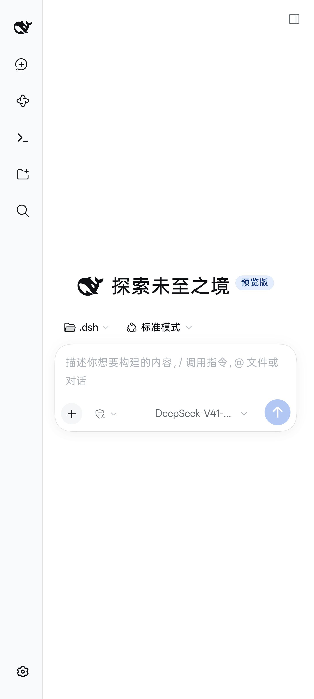
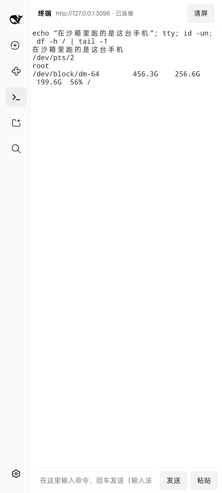
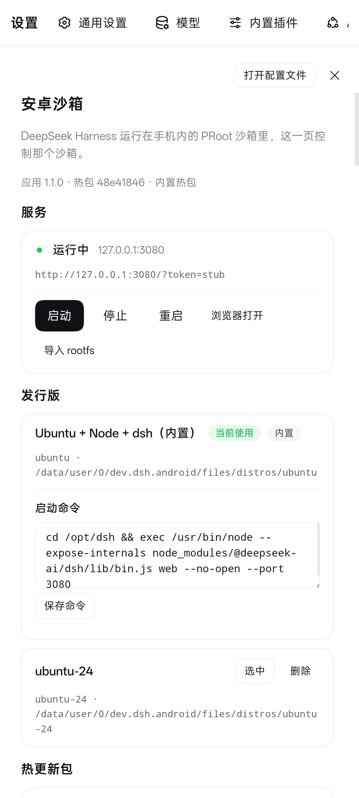

# dsh-android

把 [DeepSeek Harness](https://github.com/deepseek-ai/deepseek-harness) 装进安卓手机。

**一个 APK 搞定：不需要 Termux、不需要 root、不依赖任何其他应用。** 应用自带一套 Ubuntu 运行时，
在手机本地把 harness 跑起来，界面就是 harness 自己的 Web UI。

  
  
  

## 这是什么

DeepSeek Harness 官方以 `npx @deepseek-ai/dsh web` 的形式在电脑上跑。这个项目的做法是：
把整套运行时（Ubuntu rootfs + Node + harness 及其依赖）打进一个 APK，用 PRoot 在手机里启动它，
再用 WebView 打开它的界面 —— 于是**手机上得到的就是原样的 harness**，不是重做的客户端。

## 能干什么

- **完整的 Harness**：会话、工具调用、子代理、Agent Teams、workflow、计划模式、技能，和桌面端同一套代码。
- **沙箱终端**：左侧栏 `>_` 图标，沙箱里的真 PTY。带命令输入栏（中文输入法在终端里会乱灌候选，所以输入走独立输入框）、历史命令、粘贴。
- **挂载手机文件夹**：把任意目录挂进沙箱，agent 和终端直接读写。选目录时用系统文件夹选择器。
- **导出文件到手机**：沙箱里的文件一键复制到手机 Download，文件预览页和设置页都有入口。
- **操作手机本身**（可选，需要 [Shizuku](https://shizuku.rikka.app/)）：内置 `shiz` 命令，以 Android shell 身份执行 ——
  打开应用、看屏幕截图、调亮度、开关勿扰、读通知、装 APK……随附的 `phone-control` 技能会教 agent 怎么用。
- **跟随系统主题**：浅色/深色、连图标都会反色；Android 13+ 还支持主题化图标。

## 安装

**要求**：Android 8.0 以上、**arm64** 手机（绝大多数现代手机）。

1. 下载 `dsh-android.apk`（见 [Releases](../../releases)；如果还没有发布包，可以按 [构建文档](docs/BUILD.md) 自己打一个），拷到手机。
2. 在文件管理器里点它安装，按提示允许「未知来源」。
3. 打开应用。**首次启动需要解包约 400 MB 的运行时，大约 2 分钟**（只有这一次）；
   屏幕上会显示进度，之后每次冷启动约 5 秒。

## 第一次用

1. **配置模型**：设置 → 模型 → 填 DeepSeek API Key（也可以用其他 OpenAI 兼容的端点）。
   想省事的话，在 设置 → 安卓沙箱 → API Key 里填也行，它会作为环境变量注入沙箱。
2. **选工作区**：点「选择工作区」，选一个目录，然后就能开始对话了。
3. **（可选）授权 Shizuku**：设置 → 安卓沙箱 → Shizuku → 请求授权。
   授权后 agent 才能操作手机本身（截图、开关应用、改设置……）。
4. **（可选）挂载文件夹 / 共享手机存储**：设置 → 安卓沙箱 → 挂载。
   首次会申请存储权限，授权后沙箱里的 `/sdcard` 就是你手机上的共享存储。

## 更新

分两条通道，因为代价差很多：

| | 包含 | 体积 | 怎么做 |
|---|---|---|---|
| **热更新** | 插件、技能、系统提示词、沙箱脚本 | 几十 KB | 设置 → 安卓沙箱 → **检查更新** → 一键应用 |
| **重要更新** | 外壳：界面、图标、新接口 | ~143 MB | 同上，点「前往下载」装新 APK |

应用启动后会自己检查一次，设置页里也能随时手动检查。

**不想联网也没关系**：拿到 `dsh-hot.zip` 之后放进手机的 `Download` 目录、重开应用，同样会导入。

装新 APK 是覆盖安装，**你的会话、API Key、挂载和设置都会保留**。

## 常见问题

**首次启动卡在「正在安装内置沙箱」很久？**
正常，它在解包约 400 MB 的运行时。2 分钟左右，只做一次。请确保手机有足够空间（约 1 GB 余量）。

**为什么抓网页失败，报 `WEB_BLOCKED_URL` / non-public IP？**
手机开了 fake-IP 模式的代理（Clash 之类）时，所有域名都解析到 `198.18.0.0/15`，harness 的 SSRF 防护
会按设计拒绝。让 agent 用 `bash` + `node fetch` 绕过即可 —— 附带的技能里已经写明。

**沙箱里看不到我的文件？**
去 设置 → 安卓沙箱 → 挂载，把要用的目录加进来；或者在系统设置里授予存储权限后用 `/sdcard`。
注意：guest 里是 Linux 路径，手机上的 `Download` 在沙箱里是 `/sdcard/Download`。

**服务起不来 / 白屏怎么办？**
右上角会出现 `≡` 按钮（服务没起来时它才出现），点开是控制台：能看日志、启停服务、导入 rootfs。

**耗电吗？**
服务在前台服务里跑，带一个 CPU 保持唤醒的锁，好让长时间任务不被系统冻结。
不想要的话，设置 → 安卓沙箱 → 关掉「后台保活」。不用的时候点「停止」即可。

**支持哪些设备？**
arm64（arm64-v8a）的 Android 8.0+ 设备。x86 设备、32 位设备不支持。

## 已知限制

- APK 有 143 MB —— 因为它自带一整套 Linux 运行时，这是刻意的取舍（见 [docs/ARCHITECTURE.md](docs/ARCHITECTURE.md)）。
- 没有 root。需要 root 的操作做不到。
- 非官方项目，与 DeepSeek 没有隶属关系。

## 反馈

有问题或建议请开 [Issue](../../issues)。附上 设置 → 安卓沙箱 → 日志 里的内容会很有帮助。

## 许可与致谢

[MIT](LICENSE)。这是 [DeepSeek Harness](https://github.com/deepseek-ai/deepseek-harness)（MIT）的非官方安卓移植，
其中的品牌标识、Ubuntu、Node 及各 npm 依赖的版权归各自所有者，详见 [THIRD_PARTY.md](THIRD_PARTY.md)。

---

想自己构建、看架构设计或踩坑记录？[docs/BUILD.md](docs/BUILD.md) · [docs/ARCHITECTURE.md](docs/ARCHITECTURE.md) · [docs/FINDINGS.md](docs/FINDINGS.md)
